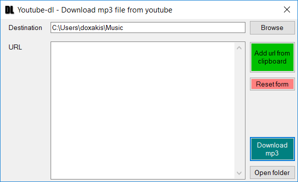

# Youtube-dl-WinGui

Simple Windows Gui for downloading mp3 file from YouTube and [others](http://rg3.github.io/youtube-dl/supportedsites.html).

Based on the work of Tosil Velkov ([Link](https://github.com/Tvel/Youtube-dl-WinGui)).

# Installation

- Download [latest-release.zip](latest-release.zip)
- Extract zip file
- (Optional) Create shortcut to Youtube-dl-WinGui.exe
- Run Youtube-dl-WinGui.exe

# Features

- Download multiple mp3 files at the same time
- It can download YouTube playlist and [more](http://rg3.github.io/youtube-dl/supportedsites.html)

# Preview

    

